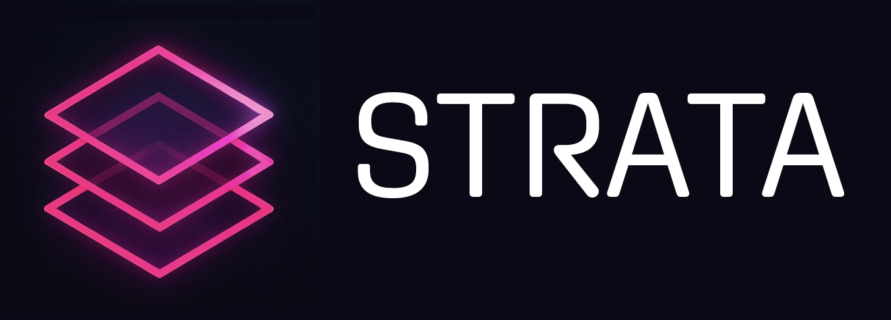

Strata is an opinionated Event Sourcing library built for Microsoft Orleans.

## Goals

- ♾️ Tentative & Confirmed State Models & Versioning
- 📷 Snapshotting
- ⏱️ Delayed Writes
- 🗃️ Orleans Provider Model via Durable Framework
- ⚡ Outbox Recipients & Projections
- 🏁 Retry, Replay, and Dry-Run Capabilities
- 📨 OOB Recipients: Direct Grain Calls, Orleans Streams, Recipient Handling

# Event Sourcing

## Build an Aggregate Model

Create an aggregate object that can handle events being applied to it. This will typically represent an aggregate root in your domain model. It can contain objects,

```csharp
[GenerateSerializer]
public class AccountAggregate
{
    public void Apply(BalanceAdjustedEvent @event)
    {
        Balance = @event.Balance;
    }

    [Id(0)]
    public string Id { get; set; } = null!;

    [Id(2)]
    public double Balance { get; set; }
}
```

## Build an Aggregate Grain

Implement a Journaled Grain that converts commands into events.

```csharp
internal sealed class AccountGrain :
    JournaledGrain<AccountAggregate, BaseAccountEvent>,
    IAccountGrain
{
    public Task<double> GetBalance() => Task.FromResult(ConfirmedState.Balance);

    public async Task Deposit(double amount)
    {
        if (amount <= 0) throw new ArgumentOutOfRangeException(nameof(amount), "Deposit amount must be positive.");
        var newBalance = ConfirmedState.Balance + amount;
        var @event = new BalanceAdjustedEvent(this.GetPrimaryKeyString()) { Balance = newBalance };
        await RaiseEvent(@event);
    }

    public async Task Withdraw(double amount)
    {
        if (amount <= 0) throw new ArgumentOutOfRangeException(nameof(amount), "Withdrawal amount must be positive.");
        if (amount > ConfirmedState.Balance) throw new InvalidOperationException("Insufficient funds for withdrawal.");
        var newBalance = ConfirmedState.Balance - amount;
        var @event = new BalanceAdjustedEvent(this.GetPrimaryKeyString()) { Balance = newBalance };
        await RaiseEvent(@event);
    }
}
```

## Handle Outbox Messages

Register an `IOutboxRecipient<TEvent>` to handle outbox messages in the `OnActivateAsync` method of your grain. This allows you to act on events, connecting other grains or passing the message to a stream or bus.

```csharp
internal sealed class AccountGrain :
    JournaledGrain<AccountAggregate, BaseAccountEvent>,
    IAccountGrain
{
    protected override void OnRegisterRecipients()
    {
        RegisterRecipient(nameof(AccountProjection), new AccountProjection(this.GrainFactory));
    }
}

public sealed class AccountProjection : IOutboxRecipient<BaseAccountEvent>
{
    private readonly IGrainFactory _grainFactory;

    public AccountProjection(IGrainFactory grainFactory)
    {
        _grainFactory = grainFactory;
    }

    public async Task Handle(int version, BaseAccountEvent @event)
    {
        if (@event is BalanceAdjustedEvent balanceEvent)
        {
            var accountId = balanceEvent.Id;
            var viewModelGrain = _grainFactory.GetGrain<IAccountViewModelGrain>(accountId);
            await viewModelGrain.UpdateBalance(balanceEvent.Balance);
        }
    }
}
```

# Sidecars

Strata provides a **Sidecar** pattern that allows you to attach auxiliary grains to primary grains for cross-cutting concerns like monitoring, logging, data collection, or background processing. Sidecars are automatically managed by the framework and can be enabled or disabled dynamically.

## Key Concepts

- **Sidecar Grain**: A grain that implements `ISidecarGrain` and provides auxiliary functionality
- **Host Grain**: A grain that implements `ISidecarHost<TSidecar>` to indicate it supports a specific sidecar
- **Lifecycle Management**: Sidecars are automatically activated when their host grain activates (if enabled)
- **State Management**: Each sidecar has persistent state to track whether it's enabled or disabled

## Creating a Sidecar Grain

Implement the `ISidecarGrain` interface to create a sidecar:

```csharp
[GrainType("user-cdp")]
public class UserCdpGrain : Grain, IUserCdpGrain
{
    public async Task InitializeSidecar()
    {
        // Perform sidecar initialization logic
        // Set reminders, collect data, establish connections, etc.

        var userGrain = GrainFactory.GetGrain<IUserGrain>(
            this.GetPrimaryKeyString()
        );

        await userGrain.SetReferenceId(Guid.NewGuid().ToString());

        // Sidecars can control their own lifecycle
        await userGrain.DisableSidecar<IUserCdpGrain>();
    }
}

public interface IUserCdpGrain : IGrainWithStringKey, ISidecarGrain
{
    // Additional sidecar-specific methods can be added here
}
```

## Creating a Host Grain

Mark your grain as a sidecar host by implementing `ISidecarHost<TSidecar>`:

```csharp
[GrainType("user")]
public class UserGrain : Grain, IUserGrain, ISidecarHost<IUserCdpGrain>
{
    private readonly IPersistentState<UserData> _state;

    public UserGrain([FromKeyedServices("state")] IPersistentState<UserData> state)
    {
        _state = state;
    }

    public async ValueTask SetReferenceId(string referenceId)
    {
        _state.State.ReferenceId = referenceId;
        await _state.WriteStateAsync();
    }

    // Other grain methods...
}

public interface IUserGrain : IGrainWithStringKey
{
    ValueTask SetReferenceId(string referenceId);
    // Other methods...
}
```

## Sidecar Lifecycle

1. **Activation**: When a host grain activates, the framework checks if any sidecars are enabled
2. **Initialization**: If enabled, the sidecar grain is retrieved and `InitializeSidecar()` is called
3. **Runtime**: Sidecars operate independently but can interact with their host grain
4. **Control**: Sidecars can be enabled/disabled dynamically using extension methods

## Controlling Sidecars

Use the provided extension methods to control sidecar state:

```csharp
// Enable a sidecar
await userGrain.EnableSidecar<IUserCdpGrain>();

// Disable a sidecar
await userGrain.DisableSidecar<IUserCdpGrain>();
```

## Setup and Configuration

Add sidecar support to your Orleans silo:

```csharp
builder.ConfigureSilo((options, siloBuilder) =>
{
    siloBuilder.AddSidecars();
    // Other configuration...
});
```
